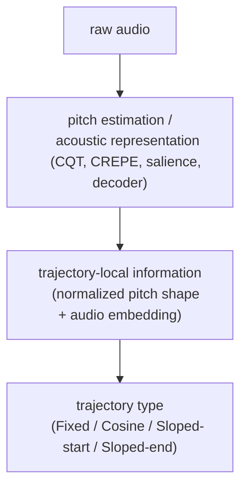
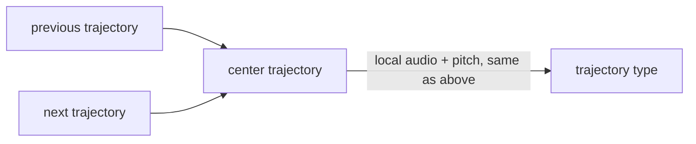
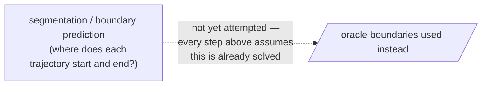

# Experiment Roadmap (Plain English)

This document explains the whole project — Steps 1 through 29 — for a reader who knows basic machine learning (train/test splits, a CNN, precision/recall) but has not followed this research day to day. It assumes nothing about earlier steps. Technical detail lives in `docs/step_N_*.md`; this document is the map, not the territory.

**Maintenance rule** (added at Step 29, applies to every future step): whenever a new numbered experiment (Step 30, 31, ...) is run, add a section to this document — question, motivation, intervention, result, plain-English interpretation, reason for the next step — using the same template used below. This is how the research story stays legible as the step count grows. Do not let this document fall behind the technical docs.

---

## What are we trying to do?

We have audio recordings of Hindustani (North Indian classical) music, along with manual annotations of how the sung/played pitch moves over time — call these annotations **trajectories**. Each trajectory is a short stretch of melody with one of four basic shapes (defined precisely below): held steady, a smooth bend, a bend that eases in gently, or a bend that eases out gently. These shapes are the building blocks of ornamentation in this music.

The long-term goal is a model that listens to raw audio and automatically writes out the transcription: where each trajectory starts and ends, and which of the four shapes it is. That is really **two separate problems**:

1. **Where does each trajectory start and end?** (segmentation)
2. **What shape is each trajectory, once you know where it is?** (typing)

Nearly every experiment in this document deliberately uses the *true, human-annotated* boundaries and only asks question 2. This is called working under **oracle boundaries** — "oracle" meaning "the correct answer, handed to the model, to remove a variable we're not testing right now." The point is to solve the typing problem in isolation before tackling segmentation, so a bad answer on one problem doesn't get blamed on the other.

---

## Glossary

- **Audio waveform** — the raw sound pressure signal over time; what a microphone actually records.
- **Spectrogram** — a picture of a waveform showing how much energy is present at each frequency, at each moment in time.
- **CQT (Constant-Q Transform)** — a specific kind of spectrogram where frequency is spaced logarithmically (like musical pitch itself), so a fixed interval — an octave — always looks the same width in the picture, regardless of register.
- **Pitch / F0 ("fundamental frequency")** — how high or low a note sounds, measured in Hz (cycles per second) or in **cents** (a musical distance unit: 1200 cents = one octave).
- **CREPE** — an existing, pretrained neural network (not built in this project) that estimates F0 directly from audio. Used here as a realistic, off-the-shelf pitch estimate to test against.
- **Drone** — the continuous background pitch (the tonic) present throughout most Hindustani performances, which can confuse pitch estimators.
- **Trajectory** — one annotated stretch of melodic pitch movement (see "What are we trying to do?" above).
- **Trajectory boundary** — the start and end time of a trajectory.
- **Oracle** — using the true, human-provided answer for something instead of a model's guess, to isolate a different question. **Oracle boundary** = true start/end times. **Oracle pitch** = the true pitch curve (reconstructed from the annotation itself, not estimated from audio).
- **Normalized phase** — rescaling a trajectory's own timeline to always run from 0 to 1, so a short trajectory and a long trajectory become directly comparable.
- **q(x)** — a trajectory's pitch curve, plotted against normalized phase (x from 0 to 1) and rescaled so its own start and end line up at fixed reference values — a "shape-only" view of the pitch movement, with duration and absolute pitch stripped out.
- **dq/dx** — the slope (rate of change) of `q(x)` — how fast the pitch is moving at each point in the normalized trajectory, i.e. its velocity.
- **Fixed** — a trajectory that holds a steady pitch (flat `q(x)`).
- **Cosine** — a trajectory with one smooth, symmetric bend from one pitch to another (its `q(x)` follows a cosine curve).
- **Sloped-start** — a bend that eases in gradually from a ramped onset rather than departing sharply.
- **Sloped-end** — a bend that eases out gradually into a ramped landing rather than snapping to the target.
- **CNN (Convolutional Neural Network)** — a neural network that scans small local patterns (in an image, spectrogram, or curve) and builds up features from them; used throughout this project as a small, cheap feature extractor.
- **Embedding** — a fixed-size list of numbers a neural network produces to summarize something (an audio clip, a pitch curve) in a form another part of the model can use.
- **Template** — here, one of the four trajectory shapes expressed as an exact mathematical formula (not learned) — used to test whether the shapes themselves, without any neural network, already separate the classes.
- **Template fitting** — classifying a trajectory by checking which of the four fixed template formulas its observed curve matches best.
- **Fusion** — combining two different sources of information (e.g. pitch and audio) inside one model.
- **Context** — information from *outside* the current trajectory (its neighbors), as opposed to *local* information (only what's inside the trajectory itself).
- **GRU (Gated Recurrent Unit)** — a small neural network building block designed to process a sequence step by step, carrying forward a memory of what it's seen.
- **BiGRU (Bidirectional GRU)** — two GRUs reading a sequence in both directions (forward and backward) and combining what each learns, so a given position's output can depend on both what came before and after it.
- **Class imbalance** — when some categories are far more common in the data than others (here, "Cosine" is roughly 10x more common than "Sloped-start").
- **Precision** — of everything the model *labeled* a given class, what fraction actually were that class. Low precision = lots of false alarms.
- **Recall** — of everything that *actually was* a given class, what fraction the model correctly found. Low recall = lots of misses.
- **F1** — a single number combining precision and recall (their harmonic mean) for one class.
- **Macro F1** — calculate F1 separately for each of the four classes, then average the four scores *equally*. This means the common class (Cosine) does **not** get more weight just because it's more common — a model that only ever predicts Cosine correctly still scores badly on macro F1, because the other three classes drag the average down.
- **Train / validation / test** — three separate slices of the data: train to fit the model, validation to decide when to stop training and which checkpoint to keep, test (never touched until the very end) to report the final honest number.
- **Grouped cross-validation** — splitting data into train/validation/test multiple times (five times here, called "5-fold"), rotating which slice is held out, so every example eventually gets tested once — while making sure all data from the same performance/recording always stays together on one side of each split.
- **Leakage** — accidentally letting information from the test set influence training (e.g. the same recording appearing in both train and test) — this silently inflates scores and invalidates the result. Guarded against throughout via grouped splits.

---

## Summary table

| Step | Main question | Bottom-line result | Why next? |
|---|---|---|---|
| 1 | What data do we actually have in IDTAP? | Built an inventory of recordings, trajectory counts, load failures. | Needed before building anything else. |
| 2 | Can we turn IDTAP into a lossless, leak-safe dataset? | Yes — 5,209/5,209 trajectories round-trip exactly; caught a real leakage bug (duplicate audio across 3 IDs). | Now safe to build targets on top of. |
| 3 | Which raw annotation types carry usable signal? | Confirmed a 4-class primitive vocabulary is separable from IDTAP's fuller type set. | Needed to design the target labels. |
| 4 | How should the messy raw annotations become a clean ML target? | Defined the T0-T3 primitive vocabulary and mapping rules. | Needed before rasterizing to a frame grid. |
| 5 | Can trajectories be expressed as continuous framewise targets without losing information? | Yes, with a validated 10ms target schema. | Ready to design a model. |
| 6 | What's the simplest architecture to test the framewise idea? | Specified (not yet trained): CQT → small CNN → temporal encoder → two output heads. | Needed a concrete plan before training. |
| 7 | Does continuous audio contain enough signal to predict trajectory type at all? | Yes — Experiment B0 (type-only) trains successfully. | Cleared to add pitch supervision. |
| 8 | Does jointly predicting pitch help the type classifier? | Tested (see `step_8_b1_report.md`). | Cleared to compare temporal encoders. |
| 9 | TCN or BiGRU for the temporal encoder? | Directly compared under identical conditions. | Architecture question closed; moved to pitch quality. |
| 10 | How good is a first pitch-estimation frontend? | Established a classical HPS baseline (~279¢ mean error) as the yardstick. | Needed before trying to beat it. |
| 11 | Can a learned, harmonic-aware frontend beat the classical baseline? | No — underperforms HPS on raw error, ties once octave mistakes are set aside. | Opened the octave/register question. |
| 12 | Why does the learned model lose specifically on octave selection? | Diagnosed the cause; proposed two candidate fixes. | Needed one closing test before moving on. |
| 12.5 | Does fusing both pitch sources plus smarter decoding fix octave errors? | Only marginal gain — not worth more decoder engineering. | Stopped register-decoder work; pivoted to a different question. |
| 13 | Does *relative* (not absolute) pitch motion survive octave errors? | Partially — octave errors mostly cancel, but real information is still lost, especially for the two "sloped" classes. | Motivated testing relative pitch directly on the real task. |
| 14 | On the real 4-class task, does estimated relative pitch alone compete with audio? | Yes, surprisingly — it even beats naive audio+pitch fusion. | The pivot: pitch estimation itself, not the classifier, looked like the bottleneck. |
| 15 | How big is the gap between oracle and estimated pitch for this task? | Huge — oracle scores ~0.77 macro F1, every estimated-pitch version tops out ~0.33. | Justified a deep dive into *why* the estimate is bad. |
| 16 | Exactly what kind of error is destroying estimated pitch's usefulness? | The decoder smooths away short, fast, direction-reversing motion. | Pointed at the temporal decoder specifically. |
| 17 | Is the decoder itself the culprit? | Yes, partially — a real, measurable tradeoff between smoothness and fine-motion fidelity. | Tried retuning the decoder's smoothing strength. |
| 18 | Can retuning that smoothing setting close the gap? | No — the apparent "best setting" turned out to be one lucky fold, not a real effect. | Closed decoder-tuning; moved further upstream. |
| 19 | Is the problem even further upstream, in the raw spectrogram itself? | Yes — the spectrogram's own analysis window is simply too wide (100+ ms) for the fast (10-40ms) motion these trajectories contain. | Found a concrete, fixable root cause. |
| 20 | Does fixing that spectrogram window actually close the gap? | Pitch estimation clearly improved (~22% lower error) — but downstream trajectory accuracy barely moved (~1% of the gap closed). | A real fix that wasn't the dominant bottleneck — redirected the whole project. |
| 21 | Should we keep fighting our own pitch pipeline, or use an off-the-shelf one? | Switched to CREPE (a pretrained, external pitch tracker) as a fixed, realistic pitch source going forward. | Freed up effort to focus on the shape-classification question directly. |
| 22 | If we normalize each trajectory's own pitch curve, does its *shape* separate the four classes? | Set up the normalized-curve representation and a small CNN to test it. | Needed before any shape-based experiments could run. |
| 23 | Does fixing class imbalance recover the classes CREPE was missing? | Partially — breaks a complete collapse on the rare classes, but Cosine confusion remains the dominant error and macro F1 improves only modestly. | Ruled out "it's just imbalance" as the full story. |
| 24 | Do the four shapes correspond to real, fittable mathematical templates? | Yes on oracle pitch (even beats the CNN there) — but worse than the CNN on CREPE, with the *opposite* error pattern. | Suggested combining the two signals. |
| 25 | Do those template-fit numbers add information the CNN doesn't already have? | No — fusing them changes almost nothing on CREPE; the model does *better* with the feature deliberately zeroed out. | Closed pitch-contour feature engineering entirely. |
| 26 | Does the original audio contain information CREPE's pitch estimate throws away? | Yes — fusing audio with CREPE clearly improves accuracy — but the gain is mostly the model over-favoring the common class (Cosine) at Sloped-start's expense. | Asked whether a richer fusion mechanism would fix that tradeoff. |
| 27 | Can one nonlinear layer in the fusion head fix that tradeoff? | No — makes *every* class worse, including Cosine. A direct check of the model's internals shows it never learned to tell the two confused classes apart. | Closed local (single-trajectory) modeling entirely. |
| 28 | Does information from *neighboring* trajectories help? | Yes — for the first time, the rare class improves *together with* the common class, not at its expense. | Justified testing whether a smarter (sequence-aware) model could use that context even better. |
| 29 | Does an order-aware sequence model (BiGRU) use that same neighbor context better than simply concatenating it? | Mixed — it demonstrably uses real neighbor information (not just extra capacity), but doesn't clearly beat the much simpler linear approach. | Recommended pausing further architecture work on this branch; see below. |

---

## Step by step

Grouped into six phases. Each step follows the same template: **Question**, **Why we asked it**, **What we changed**, **What stayed fixed**, **What happened**, **What this means in plain English**, **Why this led to the next step**.

### Phase 1 — Build a trustworthy dataset (Steps 1-5)

Getting from raw annotation exports to a clean, verified, leakage-safe dataset with well-defined framewise targets. Nothing modeling-related happens yet; this phase is entirely about making sure later results can be trusted.

#### Step 1 — What data do we actually have?

**Question.** Before building anything, what does the IDTAP annotation platform actually contain — how many recordings, how many annotated trajectories, how much of it fails to load?
**Why we asked it.** You can't design a dataset pipeline without first knowing the shape of the raw material.
**What we changed.** Nothing yet — this is a read-only inventory pass.
**What stayed fixed.** N/A (first step).
**What happened.** Built CSVs of trajectory counts, durations, and load failures per recording.
**What this means in plain English.** A basic audit: how much data is there, and how much of it is usable.
**Why this led to the next step.** Knowing what exists is a prerequisite for deciding how to convert it into a clean dataset.

#### Step 2 — Can we turn IDTAP into a lossless, leak-safe dataset?

**Question.** Can the raw IDTAP annotation format be converted into one clean document per recording without losing information or accidentally mixing up train/test data?
**Why we asked it.** The raw format is complex and performance metadata is scattered; any downstream model is only as trustworthy as this foundation.
**What we changed.** Built a canonical JSON schema per recording, keeping the raw annotation and everything computed from it in clearly separated blocks.
**What stayed fixed.** The underlying IDTAP annotations themselves — never modified, only re-expressed.
**What happened.** All 5,209 trajectories reconstruct to *exactly* zero error against the original annotation. Grouping recordings by performance (not just by file ID) caught a real bug: one performance had been uploaded as audio split across three different IDs, which would have silently leaked the same audio across a train/test split if not caught.
**What this means in plain English.** The dataset conversion is provably lossless, and a genuine data-leakage trap was found and fixed before it could quietly inflate later results.
**Why this led to the next step.** With a trustworthy dataset in hand, the next question is which parts of the raw annotation vocabulary are actually usable.

#### Step 3 — Which raw annotation types carry usable signal?

**Question.** Of all the annotation types IDTAP records (not just the four shapes we care about — there are over a dozen), which ones are common and clean enough to build a target vocabulary from?
**Why we asked it.** Needed before deciding how to simplify IDTAP's full type system into the four target classes.
**What we changed.** Nothing modeling-related — a structural/statistical survey of trajectory counts, durations, and transitions.
**What stayed fixed.** The dataset from Step 2.
**What happened.** Confirmed the four target shapes are separable from IDTAP's fuller type set with a well-defined mapping.
**What this means in plain English.** The four-class scheme this whole project uses is a deliberate simplification of a messier real annotation system, and that simplification was checked, not assumed.
**Why this led to the next step.** Ready to formally define the mapping rules from raw types to the four target classes.

#### Step 4 — How should the raw annotations become a clean ML target?

**Question.** What are the exact rules for turning every raw IDTAP trajectory type into one of the four target classes (or excluding/masking it)?
**Why we asked it.** Needed a fully specified, reproducible transformation before generating any training targets.
**What we changed.** Defined the T0-T3 primitive vocabulary and decomposition/masking rules for every raw type.
**What stayed fixed.** The Step 2 dataset.
**What happened.** Every raw trajectory type is now mapped, decomposed into pieces, or explicitly excluded — nothing is silently dropped.
**What this means in plain English.** A complete, auditable recipe now exists for "raw annotation in, clean four-class label out."
**Why this led to the next step.** With the label recipe defined, the next step rasterizes it onto a continuous timeline.

#### Step 5 — Can trajectories become continuous framewise targets without losing information?

**Question.** Can the (now-defined) four-class labels be expressed as a continuous, 10-millisecond-per-frame target track, and is the result learnable (i.e., are class boundaries actually inferable from the pitch data)?
**Why we asked it.** A framewise (rather than one-label-per-clip) target is what a continuous-audio model needs to train on.
**What we changed.** Built the framewise rasterization and a boundary-learnability audit.
**What stayed fixed.** The Step 4 label rules.
**What happened.** Validated framewise target schema; measured class balance and boundary learnability.
**What this means in plain English.** The data is now in the exact shape a real-time, frame-by-frame model would need.
**Why this led to the next step.** The dataset foundation is complete — ready to design and train an actual model.

### Phase 2 — Establish simple classification baselines (Steps 6-9)

Specifying and training the first, deliberately simple continuous-audio architecture (CQT → CNN → temporal encoder), and settling the TCN-vs-BiGRU question. Scaffolding for everything that follows.

#### Step 6 — What's the simplest architecture to test the framewise idea?

**Question.** What is the simplest reasonable neural network design for predicting trajectory type continuously from audio?
**Why we asked it.** Needed a concrete, minimal plan — not an architecture search — before spending any training compute.
**What we changed.** Specified (on paper/in code, not yet trained): audio → CQT spectrogram → small frequency-CNN → a temporal encoder → two output heads (type classification, pitch regression).
**What stayed fixed.** Everything from Phase 1.
**What happened.** Exact parameter counts and timing alignment were locked down; a staged experiment sequence (B0 → B1 → C) was planned.
**What this means in plain English.** Before training anything, the team wrote down exactly what would be built and how it would be tested, so later comparisons would be apples-to-apples.
**Why this led to the next step.** Time to actually train the simplest version of this plan.

#### Step 7 — Does continuous audio contain enough signal to predict type at all?

**Question.** Trained only to predict trajectory type (no pitch supervision), does the Step 6 architecture learn anything useful from continuous audio?
**Why we asked it.** This is the most basic sanity check — if this fails, nothing more complex is worth trying.
**What we changed.** Trained Experiment B0: the type-only version of the Step 6 architecture, with grouped 5-fold cross-validation.
**What stayed fixed.** Architecture, dataset, frame grid.
**What happened.** The model trains successfully (see `step_7_b0_report.md` for full numbers).
**What this means in plain English.** Yes — there's real signal in continuous audio for this task, clearing the way for more refined experiments.
**Why this led to the next step.** With a working type-only baseline, the next question is whether adding pitch supervision helps.

#### Step 8 — Does jointly predicting pitch help the type classifier?

**Question.** If the same model is also trained to predict tonic-relative pitch (in cents) alongside trajectory type, does that improve the type predictions?
**Why we asked it.** Trajectory shape is fundamentally about how pitch moves, so forcing the shared network to also explain pitch might sharpen its shape features.
**What we changed.** Added a second output head (pitch regression) to the identical B0 architecture — Experiment B1.
**What stayed fixed.** Architecture, data, training budget — only the additional pitch-supervision signal changed.
**What happened.** Compared directly against B0 (see `step_8_b1_report.md`).
**What this means in plain English.** Tests whether "understanding pitch" and "understanding shape" reinforce each other when learned together.
**Why this led to the next step.** With both a type-only and a type+pitch baseline in hand, the last basic architecture question is which temporal encoder to use.

#### Step 9 — TCN or BiGRU for the temporal encoder?

**Question.** Of the two most natural choices for the model's temporal-processing component — a dilated convolutional network (TCN) or a bidirectional recurrent network (BiGRU) — which works better here?
**Why we asked it.** Needed to settle this basic architecture choice before moving on to pitch-quality questions, which are orthogonal to it.
**What we changed.** Swapped only the temporal encoder, keeping data, pitch supervision, folds, and everything else from B1 identical — Experiment C.
**What stayed fixed.** Everything except the temporal encoder.
**What happened.** Directly compared (see `step_9_c_report.md`). This is a *different* BiGRU from the one revisited in Step 29 — this one runs over raw 10ms audio frames within a single trajectory, not over whole compressed trajectories.
**What this means in plain English.** A controlled bake-off between two standard sequence-modeling choices.
**Why this led to the next step.** With the basic architecture settled, the project turns to a much bigger and more persistent question: why is the pitch signal itself unreliable?

### Phase 3 — Find out why pitch estimation is failing (Steps 10-20)

The long diagnostic arc: build a pitch-estimation pipeline from scratch (salience frontend → register/octave resolution → temporal decoder), discover a huge gap between what's achievable with true pitch versus estimated pitch, and trace that gap step by step — frontend, decoder, spectrogram window — down to its root cause. Ends with a real fix that, once actually tested end-to-end, turns out not to be the dominant bottleneck after all.

#### Step 10 — How good is a first pitch-estimation frontend?

**Question.** What's a reasonable, well-understood baseline for estimating pitch from this project's own audio pipeline, before trying anything fancy?
**Why we asked it.** Needed a fixed yardstick to measure every later pitch-estimation attempt against.
**What we changed.** Built and evaluated a classical harmonic-product-spectrum (HPS) pitch estimator and a few learned alternatives.
**What stayed fixed.** The CQT audio frontend and dataset from Phase 1-2.
**What happened.** HPS became the frozen baseline, at roughly 279 cents of mean pitch error.
**What this means in plain English.** A simple, non-learned method (HPS) set the bar every future pitch model would need to clear.
**Why this led to the next step.** Time to test whether a learned model could beat this classical baseline.

#### Step 11 — Can a learned, harmonic-aware frontend beat the classical baseline?

**Question.** Does a neural network that explicitly looks at harmonic structure (built specifically for this project) do better than the HPS baseline?
**Why we asked it.** A learned model that understands harmonics *should*, in principle, be able to do at least as well as a fixed classical formula.
**What we changed.** Trained a small harmonic-aware salience CNN and compared it directly against HPS on the same data.
**What stayed fixed.** Dataset, CQT frontend, evaluation protocol.
**What happened.** The learned model actually underperformed HPS on raw error, though the two were roughly tied once octave (register) mistakes were factored out.
**What this means in plain English.** The learned model's main weakness wasn't understanding pitch in general — it was specifically choosing the right octave.
**Why this led to the next step.** That specific weakness (octave selection) became the next thing to diagnose.

#### Step 12 — Why does the learned model lose specifically on octave selection?

**Question.** What exactly causes the learned salience model's octave (register) errors, and can a smarter decision step fix them?
**Why we asked it.** Step 11 pinpointed *where* the problem was; this step asked *why*, and what might fix it.
**What we changed.** Ran targeted diagnostics on the octave-confusion pattern and proposed two candidate decoding strategies.
**What stayed fixed.** The trained models from Step 11.
**What happened.** Diagnosed the cause and identified candidate fixes to test.
**What this means in plain English.** Rather than guessing at a fix, the team first characterized exactly how the octave errors happen.
**Why this led to the next step.** One combination of fixes (fusing both pitch sources with smarter decoding) still needed a closing test.

#### Step 12.5 — Does fusing both pitch sources plus smarter decoding fix octave errors?

**Question.** Specifically: does running the smarter decoder (from Step 12) on a *fusion* of the classical and learned salience maps, rather than either alone, meaningfully fix octave errors?
**Why we asked it.** This was the one combination Step 12 left untested, and a cheap way to close out the register-resolution question.
**What we changed.** Ran the fusion+smart-decoder combination.
**What stayed fixed.** Everything else from Steps 10-12.
**What happened.** Only a marginal improvement — not worth further decoder engineering.
**What this means in plain English.** Register-resolution engineering had reached diminishing returns; time to look elsewhere.
**Why this led to the next step.** Rather than keep tuning the decoder, the project asked whether *relative* pitch motion (rather than absolute pitch) might sidestep the octave problem entirely.

#### Step 13 — Does relative pitch motion survive octave errors?

**Question.** If octave (register) errors are the main problem, does looking at frame-to-frame pitch *change* (which should be unaffected by a constant octave offset) preserve more usable information than absolute pitch?
**Why we asked it.** A octave mistake is roughly a constant shift; differencing (looking at motion, not position) should cancel out a constant shift, in principle.
**What we changed.** Computed relative/local pitch-motion signals and tested how well they alone predict trajectory type.
**What stayed fixed.** Pitch estimation pipeline, decoders, and hyperparameters from Steps 12/12.5.
**What happened.** Partially confirmed — octave errors mostly do cancel out under differencing, but real information is still lost this way, especially for the two "sloped" classes.
**What this means in plain English.** Relative pitch helps with the specific octave-confusion problem, but isn't a magic fix for the underlying pitch-quality issue.
**Why this led to the next step.** Time to test relative pitch directly on the real 4-class classification task, not just as an isolated diagnostic.

#### Step 14 — On the real task, does estimated relative pitch alone compete with audio?

**Question.** In a controlled, direct comparison — audio alone, estimated relative pitch alone, or both together — which input(s) actually drive real trajectory-type accuracy?
**Why we asked it.** All the diagnostics so far were indirect; this tested the real, final task head-on.
**What we changed.** Trained the same classifier under four different input conditions (audio only / pitch only / both naively fused / audio + oracle pitch).
**What stayed fixed.** The classifier architecture and training protocol.
**What happened.** Surprisingly, estimated relative pitch *alone* beat both audio-alone and a naive audio+pitch fusion.
**What this means in plain English.** If pitch information were fully redundant with what's in the audio, this shouldn't happen — it strongly suggested the audio-processing branch wasn't the real bottleneck. The bottleneck was pitch estimation itself.
**Why this led to the next step.** This result reframed the whole project: rather than improve the classifier, the priority became measuring and fixing pitch-estimation quality directly.

#### Step 15 — How big is the gap between oracle and estimated pitch for this task?

**Question.** If the classifier were given the *true* pitch curve instead of an estimated one, how much better would it do — and does that gap hold up under a fair, matched comparison?
**Why we asked it.** Needed to know whether pitch-estimation quality was really the bottleneck, and by how much, before investing further diagnostic effort.
**What we changed.** Trained matched versions of the classifier on: a fixed encoding of estimated pitch, two different learned pitch-motion representations, and (as an upper-bound control) the true oracle pitch.
**What stayed fixed.** Classifier architecture, training budget, and folds — identical across all four conditions.
**What happened.** Oracle pitch reached roughly 0.77 macro F1; every estimated-pitch version topped out around 0.33 — more than double the achievable performance was left on the table.
**What this means in plain English.** The classifier itself is fully capable of solving this task — the problem is entirely about the quality of the pitch estimate it's given.
**Why this led to the next step.** This number (0.77 vs. 0.33) became the reference gap the rest of Phase 3 tried to close, starting with a detailed audit of exactly what kind of error the estimated pitch contains.

#### Step 16 — Exactly what kind of error is destroying estimated pitch's usefulness?

**Question.** Is the estimated-pitch problem about wrong pitch values, wrong octave, timing lag, smoothing, jitter, or something else — and which of these actually matters for trajectory classification?
**Why we asked it.** "Estimated pitch is worse" isn't actionable on its own; each candidate cause implies a different fix.
**What we changed.** Ran a diagnostic-only audit (no new models trained) separating out each of these error types individually.
**What stayed fixed.** The Step 15 pitch estimates and classifier.
**What happened.** The dominant issue: the pitch decoder smooths away short, fast, direction-reversing motion — exactly the kind of motion the "sloped" trajectory shapes depend on.
**What this means in plain English.** It's not that the pitch estimate is randomly noisy — it specifically and systematically erases the fine, quick wiggles these shapes are defined by.
**Why this led to the next step.** This pointed directly at the temporal decoding step (the part of the pipeline that smooths raw evidence into a final pitch curve) as the next thing to test.

#### Step 17 — Is the decoder itself the culprit?

**Question.** Is the pitch-motion loss actually caused by the temporal decoder's smoothing, or was that motion already missing from the raw per-frame evidence before decoding?
**Why we asked it.** Step 16 diagnosed smoothing as the symptom; this step tested whether the decoder specifically was responsible.
**What we changed.** Compared the decoded pitch path against a version with no temporal smoothing at all, across a range of smoothing strengths.
**What stayed fixed.** The underlying per-frame pitch evidence.
**What happened.** Found a real, measurable, and mechanistically understandable tradeoff: more smoothing improves average accuracy but costs fine-motion (turning-point) fidelity.
**What this means in plain English.** The decoder is a genuine dial between "smoother but blunter" and "sharper but noisier" — and confirmed the decoder itself matters, not just the raw evidence.
**Why this led to the next step.** Since the smoothing dial matters, the obvious next test was whether simply retuning it would help the real classification task.

#### Step 18 — Can retuning the decoder's smoothing strength close the gap?

**Question.** Does picking a better setting for the decoder's smoothing strength meaningfully improve real trajectory classification?
**Why we asked it.** Step 17 showed the dial is real; this step tested whether turning it actually pays off downstream.
**What we changed.** Retrained the classifier on pitch decoded with two untested smoothing settings and compared trajectory macro F1.
**What stayed fixed.** Every other part of the pipeline.
**What happened.** A pooled-data "improvement" for one setting looked promising at first — but a closer, fold-by-fold and recording-by-recording check revealed it was driven almost entirely by a single lucky fold, not a real, general effect.
**What this means in plain English.** An apparent win that doesn't survive being checked at a finer grain isn't a real win — this is exactly the kind of statistical illusion careful cross-validation is meant to catch.
**Why this led to the next step.** With decoder-tuning closed off as a lever, the search for the real bottleneck moved further upstream, to the raw acoustic representation itself.

#### Step 19 — Is the problem even further upstream, in the raw spectrogram?

**Question.** Does the acoustic frontend (the spectrogram computation itself, before any pitch decoding happens) have enough time resolution to represent the fast pitch motion these trajectories contain?
**Why we asked it.** Every fix so far (frontend model, decoder, smoothing) operated *after* the spectrogram was already computed; this step checked the one earlier stage nobody had audited yet.
**What we changed.** Combined a theoretical calculation of the spectrogram's actual time-resolution with empirical per-stage audits (of the spectrogram, the salience stage, and the decoder) and a synthetic no-learning sanity test.
**What stayed fixed.** The classifier and decoder.
**What happened.** Found the real bottleneck: the spectrogram's own analysis window is 130-1000 milliseconds wide, while the trajectory motion it's being asked to capture happens on a 10-40 millisecond timescale — a fundamental mismatch. The salience and decoding stages were shown to behave reasonably given what they're handed; they were not the problem.
**What this means in plain English.** It's like trying to photograph a hummingbird's wingbeats with a camera whose shutter is open for a tenth of a second — no amount of cleverness downstream of the camera can recover motion the camera itself never captured.
**Why this led to the next step.** This gave a concrete, specific, testable fix to try: shorten the spectrogram's time window.

#### Step 20 — Does fixing that spectrogram window actually close the gap?

**Question.** If the spectrogram's time window is shortened (as Step 19 recommended), does pitch estimation improve — and more importantly, does *trajectory classification* improve?
**Why we asked it.** This was the direct test of the root cause diagnosed in Step 19 — the natural conclusion of the entire Phase 3 investigation.
**What we changed.** First (Phase A) audited several shorter-window spectrogram variants cheaply and picked the best one; then (Phase B) rebuilt the *entire* pitch pipeline — salience model, register/decoder tuning, and the trajectory classifier — from scratch on that new spectrogram, and re-measured everything end to end.
**What stayed fixed.** The classifier architecture, training protocol, and every other pipeline stage's *logic* (only their inputs changed).
**What happened.** Pitch estimation clearly and consistently improved on every metric (about 22% lower error, 6 points higher correct-octave rate). But downstream trajectory classification barely moved — only about 1% of the oracle-vs-estimated gap closed.
**What this means in plain English.** The diagnosis was correct and the fix genuinely worked at the level it targeted — but pitch accuracy, it turns out, was not the dominant thing standing between the classifier and much better performance. This was the project's most important negative result: a well-reasoned, carefully tested fix that didn't deliver at the level that mattered most.
**Why this led to the next step.** With the entire "improve our own pitch-estimation pipeline" avenue now tested about as thoroughly as reasonably possible, the project pivoted: freeze pitch estimation using a strong off-the-shelf tool, and go looking for whether the answer lies somewhere else entirely (the trajectory's shape, the audio itself, or its neighbors).

### Phase 4 — Test whether trajectory shape alone solves the problem (Steps 21-25)

A reset: freeze a realistic, off-the-shelf pitch source (CREPE) and ask a narrower question — given that pitch source, does the trajectory's own normalized shape separate the four classes? Tests normalization, class balancing, and exact mathematical templates for the four shapes, each cleanly ruled in or out.

#### Step 21 — Should we keep fighting our own pitch pipeline, or use an off-the-shelf one?

**Question.** Rather than continuing to refine this project's own from-scratch pitch-estimation pipeline, would switching to a strong, pretrained, external pitch tracker (CREPE) give a more productive foundation for the remaining questions?
**Why we asked it.** Phase 3 had tested this project's own pipeline about as thoroughly as reasonably possible; CREPE offered a way to separate "is pitch estimation in general the limiting factor" from "is *this project's specific* pitch pipeline the limiting factor."
**What we changed.** Adopted CREPE as the frozen, default pitch source for all subsequent trajectory-typing experiments.
**What stayed fixed.** The overall oracle-boundary, four-class typing task.
**What happened.** CREPE frozen as the pitch source going forward.
**What this means in plain English.** A pragmatic reset — stop re-deriving pitch estimation from scratch, and use a proven, external tool instead, to focus remaining effort on the classification question itself.
**Why this led to the next step.** With a fixed, realistic pitch source in hand, the project could now cleanly test whether a trajectory's own normalized shape is enough to classify it.

#### Step 22 — Does a trajectory's normalized shape separate the four classes?

**Question.** If each trajectory's pitch curve is rescaled (both in time and in pitch range) to a standard 0-to-1 "shape-only" form, does that shape alone let a small classifier tell the four classes apart?
**Why we asked it.** This is the most direct, minimal test of "do the labels correspond to learnable geometric shapes" using the new CREPE-based pitch source.
**What we changed.** Built the normalized-phase contour representation (`q(x)`, `dq/dx`) and a small CNN to classify directly from it, on both oracle and CREPE pitch.
**What stayed fixed.** CREPE extraction, oracle boundaries, grouped folds.
**What happened.** Set up and validated the representation and baseline model (see `step_22_oracle_boundary_shape.md`).
**What this means in plain English.** Established the core "look at the shape, not the raw numbers" approach used through the rest of the project.
**Why this led to the next step.** With a working shape-based classifier, the next obvious question was whether class imbalance (Cosine being far more common) was hiding real performance on the rarer classes.

#### Step 23 — Does fixing class imbalance recover the classes CREPE was missing?

**Question.** Is the classifier's poor performance on the rare classes (Sloped-start, Sloped-end) mainly because they're underrepresented in training, and does balancing the training data fix it?
**Why we asked it.** Class imbalance is one of the most common, well-understood causes of poor minority-class performance, and the cheapest thing to test first.
**What we changed.** Compared unweighted training against two balancing interventions (oversampling the rare classes; weighting the loss function).
**What stayed fixed.** The Step 22 shape representation and architecture.
**What happened.** Balancing broke a complete early collapse on the rare classes (from literally 0% recall to a real, nonzero number) — but Cosine confusion remained the single dominant error, and overall macro F1 improved only modestly.
**What this means in plain English.** Imbalance was a real, contributing problem — but fixing it alone doesn't solve the underlying difficulty of telling these shapes apart from CREPE's noisier pitch.
**Why this led to the next step.** With imbalance ruled out as the *whole* explanation, the project asked whether the shapes' own known mathematical structure (rather than a generic CNN) could do any better.

#### Step 24 — Do the four shapes correspond to real, fittable mathematical templates?

**Question.** Since the four trajectory types are literally defined by exact formulas (a constant, a cosine curve, and two power-law ramps), does directly fitting those formulas to an observed pitch curve — no neural network, no training — classify trajectories well?
**Why we asked it.** A more direct, interpretable test of whether the geometry itself is the signal, independent of any particular classifier's ability to learn it.
**What we changed.** Recovered the four exact template formulas from the annotation software's own code, and classified each trajectory by whichever template its observed curve matches best.
**What stayed fixed.** The same CREPE and oracle pitch sources from Step 22-23.
**What happened.** On oracle (clean) pitch, template fitting is excellent — even better than the CNN. On CREPE (noisy) pitch, it's worse than the balanced CNN, and fails in the *opposite* way (over-predicting the two "sloped" shapes rather than collapsing onto Cosine).
**What this means in plain English.** The geometry really is correct and highly informative — proven by how well it works on clean data — but simple template-matching is fragile to real-world pitch noise in a way a trained neural network partially compensates for.
**Why this led to the next step.** Since templates and the learned CNN fail in opposite, seemingly complementary ways, the obvious next test was whether combining them helps.

#### Step 25 — Do template-fit numbers add information the CNN doesn't already have?

**Question.** If the template-fitting quality (from Step 24) is added as an extra input feature to the CNN, does it improve classification on realistic (CREPE) pitch?
**Why we asked it.** The two methods' opposite failure patterns (Step 24) suggested real complementary information might exist.
**What we changed.** Fused a normalized version of the four template-fit scores into the CNN, immediately before its final classification layer.
**What stayed fixed.** The CNN architecture, training protocol, and CREPE pitch source.
**What happened.** Essentially no change — fusing the template scores barely moves macro F1 at all, and a careful check (deliberately zeroing the added feature at test time, without retraining) showed the model actually does *slightly better* without it, despite having assigned it real weight during training. An optional check on clean oracle pitch showed template information genuinely is useful there — it's specifically CREPE's noise that turns a good feature into a useless one.
**What this means in plain English.** The CNN was already implicitly capturing whatever the templates could offer; adding them explicitly was redundant, not complementary, once pitch is noisy. Six different ways of representing or using CREPE's pitch contour had now all landed in the same narrow performance range.
**Why this led to the next step.** Contour-feature engineering was declared exhausted. The next open question was whether the pitch contour was even the right *source* of information to lean on — could the original audio, independent of any pitch estimate, carry information CREPE was discarding?

### Phase 5 — Test information beyond the CREPE contour (Steps 26-27)

Does the original audio carry information the pitch estimate alone discards? Yes — but combining it well turns out to be harder than it sounds, and making the combination mechanism fancier (Step 27) actively makes things worse.

#### Step 26 — Does the original audio contain information CREPE's pitch estimate throws away?

**Question.** Beyond whatever pitch information CREPE extracts, does the raw audio itself (fed through its own small encoder) contain additional information useful for trajectory typing?
**Why we asked it.** Phase 4 had exhausted every reasonable way of re-representing the *pitch contour itself*; this asked whether a different modality (audio) held information CREPE simply never captured.
**What we changed.** Trained a small audio encoder (on the same oracle-boundary segments) and compared: CREPE alone, audio alone, and CREPE+audio combined by simple concatenation and a single linear layer.
**What stayed fixed.** The frozen CREPE contour branch and its own encoder, from Step 25.
**What happened.** Audio alone was a weak classifier by itself, but combining it with CREPE via simple fusion clearly beat CREPE alone overall. Digging into *why*, though: most of that gain was the model learning to favor the common class (Cosine) more — Cosine recall roughly doubled, while Sloped-start recall collapsed from about 50% to about 8%.
**What this means in plain English.** Audio does contain real, usable extra information (confirmed by directly testing whether the trained model's performance drops when the audio input is deliberately blanked out — it does, sharply) — but the *simple* way of combining it mostly taught the model to lean harder on its best-supported guess rather than to genuinely tell the confusing classes apart.
**Why this led to the next step.** This raised a direct, testable question: was that tradeoff a fundamental limit of the information available, or just a limitation of the *simple linear* way the two signals were being combined?

#### Step 27 — Can a nonlinear fusion layer fix that Cosine/Sloped-start tradeoff?

**Question.** If the audio+pitch fusion mechanism is made slightly more expressive — one small nonlinear layer, instead of pure addition — can it retain Step 26's Cosine improvement while also recovering Sloped-start?
**Why we asked it.** A purely linear combination mathematically cannot express "this audio pattern only means Cosine when the pitch shape also looks a certain way" — a nonlinear layer, in principle, can.
**What we changed.** Replaced the single linear fusion layer with `linear → ReLU → linear` (one small hidden layer), keeping both encoders and everything else identical to Step 26.
**What stayed fixed.** Both encoders, the data, the training protocol — the fusion mechanism was the only variable.
**What happened.** Worse — on *every single class*, including Cosine, which the linear version had actually improved. A direct inspection of the nonlinear layer's internal activations showed it never learned to represent Cosine and Sloped-start any differently from each other — not even a little.
**What this means in plain English.** Giving the model more expressive power to combine the two signals didn't help it find a better combination — it just made training harder without finding anything new to exploit. The problem wasn't that linear fusion was too restrictive.
**Why this led to the next step.** This closed the door on improving things by making the *local* (single-trajectory) model more sophisticated. Every reasonable local approach — pitch alone, audio alone, linear fusion, nonlinear fusion — had now been tried. The only remaining lever was information from *outside* a single trajectory: its neighbors.

### Phase 6 — Test trajectory context (Steps 28-29)

Stepping outside a single trajectory: does knowing about its neighbors help classify it? Yes, and for the first time without the usual tradeoff — but a fancier (sequence-aware) way of using that context doesn't clearly beat the simplest possible one.

#### Step 28 — Does information from neighboring trajectories help?

**Question.** If a model is also given the previous and next trajectory's own (observable, not true-label) pitch and audio information, does that improve classification of the trajectory in the middle?
**Why we asked it.** With every local (single-trajectory) approach exhausted (Steps 21-27), context was the clear next lever to test.
**What we changed.** Built the previous/center/next trajectory triplet (respecting real gaps and recording boundaries), and compared: local-only (reused from Step 26), a simple linear model over all three trajectories' information concatenated together, and a variant using only the neighbors' pitch (not audio).
**What stayed fixed.** The encoders and per-trajectory representation from Step 26; still oracle boundaries throughout; strictly no use of the neighbors' *true* labels (only their own observable audio/pitch), since those labels are the very thing being predicted.
**What happened.** The full-context version clearly beat the local-only baseline — and, for the first time in this entire project, the rare class (Sloped-start) improved *at the same time* as the common class (Cosine), rather than trading off against it. A deliberately non-deployable control (giving the model the neighbors' *true* labels, just to see the ceiling) scored higher still, showing real headroom remains, but confirmed observable context alone was already capturing a meaningful chunk of it.
**What this means in plain English.** Knowing what came just before and just after a trajectory really does help decide what it is — the surrounding melodic context contains real, exploitable information, not just noise.
**Why this led to the next step.** Since simple context helped, the natural next test was whether a model actually designed to understand *sequences* (rather than just concatenating three things into one flat list) could use that same context even more effectively.

#### Step 29 — Does an order-aware sequence model use that context better than simple concatenation?

**Question.** If a small bidirectional recurrent network (BiGRU) processes the previous/center/next trajectories as an actual ordered sequence, does it extract more useful information from the same ±1 context window than Step 28's simple linear concatenation did?
**Why we asked it.** A linear layer over concatenated inputs can only add independent weighted contributions; a sequence model can in principle represent relationships like "what matters depends on the order things happened in."
**What we changed.** Replaced the linear context layer with a BiGRU reading the three-trajectory sequence, reading its output at the center position only. Also trained a same-size, same-architecture "blind" control that never sees real neighbor content, to separate "uses context" from "just has more parameters."
**What stayed fixed.** The same ±1 context window, the same underlying per-trajectory representation, the same training protocol as Step 28 — sequence modeling was the only new variable.
**What happened.** Mixed. The sequence model clearly used real neighbor information — it beat its own capacity-matched blind control by a wide margin, and a diagnostic that swapped "previous" and "next" at test time showed performance dropped noticeably, confirming it genuinely uses the ordering. But it did **not** clearly beat Step 28's much simpler linear approach: overall accuracy was roughly a wash depending on exactly how it was measured, the rare class improved only slightly (and via a worse precision/recall pattern than hoped), and the common class actually gave back a little ground.
**What this means in plain English.** The fancier model isn't broken or fooling itself — it demonstrably learns to use real sequential information — but that extra sophistication, at nearly double the parameter count, didn't translate into a clearly better trajectory classifier than the much simpler "just concatenate the neighbors" approach already tested. More architectural cleverness didn't pay for itself here.
**Why this led to the next step.** With the linear ±1-context approach frozen as the best result so far, and both the more-sophisticated-fusion (Step 27) and more-sophisticated-sequence (Step 29) experiments landing as non-wins, the project faces an open choice: push into a longer or differently structured context window, or step back and ask whether the segmentation problem — deliberately set aside since Phase 1 — is now the more important place to invest.

---

## What have we learned overall?

1. **The four labels are not arbitrary categories — they're real geometric shapes.** Each one is an exact mathematical curve (a constant, a cosine, or one of two power-law ramps), reconstructed directly from the annotation software's own formulas, not invented for this project.

2. **Given clean pitch information, the classifier is excellent.** When fed the true pitch curve, macro F1 reaches roughly 0.77-0.82 (out of a maximum of 1.0) — proof that a small CNN can tell these four shapes apart very well, *if* it's looking at accurate pitch.

3. **Realistic (estimated) pitch loses a lot of the fine detail those shapes depend on.** With either this project's own pitch-estimation pipeline or CREPE (an established, external pitch tracker), macro F1 drops to roughly 0.31-0.37 — well under half of what's achievable with clean pitch.

4. **Repeatedly changing how the pitch estimate is represented did not close that gap.** Fixed-time deltas, normalized contours, velocity, different training objectives, mathematical templates, and fusing templates with the learned model were all tried; every one landed in essentially the same 0.31-0.37 range.

5. **Class imbalance was a real contributor early on, but not the whole story.** Balancing the training data broke a complete early collapse on the rare classes, but a large, specific confusion between two of the shapes (Cosine and Sloped-start) persisted regardless.

6. **Template fitting confirmed the geometry is real but showed it's fragile under noisy pitch.** On clean pitch, the plain mathematical templates alone are one of the *best*-performing methods tried anywhere in this project. On CREPE's noisier pitch, they fall apart — strong evidence that the shapes themselves are sound, and the bottleneck really is pitch-estimation quality, not label quality.

7. **Even fixing the diagnosed acoustic bottleneck barely moved the needle.** Step 19 traced the estimation problem to the spectrogram's own timing resolution; Step 20 fixed that and confirmed pitch estimation genuinely improved — but downstream trajectory accuracy moved by only about 1% of the total gap. This was the project's most important negative result: the obvious, carefully-diagnosed fix wasn't the dominant lever after all.

8. **Audio (beyond just pitch) does carry real, usable extra information — but combining it well is hard.** Adding the raw audio signal alongside the pitch estimate clearly helps overall, but the gain was mostly the model leaning harder on the common class rather than genuinely telling the two confused classes apart; making the combination mechanism more sophisticated (a small neural layer instead of simple addition) made results *worse*, not better, and a direct look inside that layer showed it never learned to separate the two confused classes at all.

9. **Trajectory context (information from neighboring trajectories) is the first thing that has helped without the usual tradeoff.** Knowing about the previous and next trajectory's own audio and pitch — never their true labels — let both the common class and the rare class improve together. But a more sophisticated, order-aware way of using that same context (Step 29) did not clearly beat the simplest possible way (just concatenating the neighbors' information).

**Where this leaves the project:** the oracle-boundary trajectory-*typing* problem has now been attacked from nearly every local and near-local angle — pitch-only, audio-only, multiple fusion mechanisms, and immediate context — with real but incomplete progress, and the two most recent architecture experiments (Steps 27 and 29) both came back negative or ambiguous. The next decision is whether to push further into longer-range context, or to step back and ask whether segmentation (the *other* half of the original problem, deliberately set aside since Phase 1) is now the more important thing to work on.

---

## The conceptual picture

**Within one trajectory — Phases 2-5:**

**Across trajectories — Phase 6:**

**What's still deliberately out of scope, throughout every step above:**

Segmentation remains a later problem: every experiment in this document, Steps 21 through 29 especially, assumes the true trajectory boundaries are already known, specifically so that typing errors are never confused with boundary errors. Whether that assumption is now worth revisiting — since typing itself is running out of easy wins — is exactly the open question Step 29 ends on.
